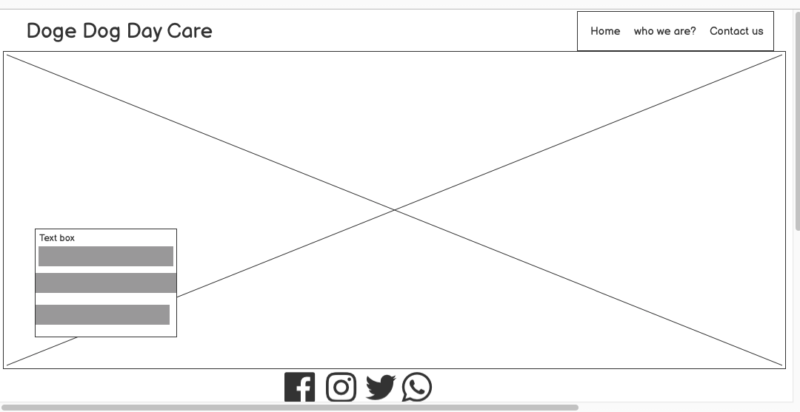
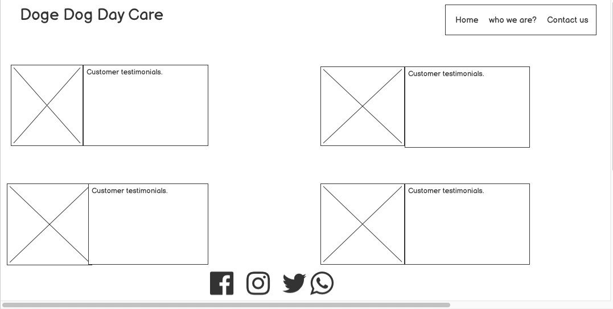
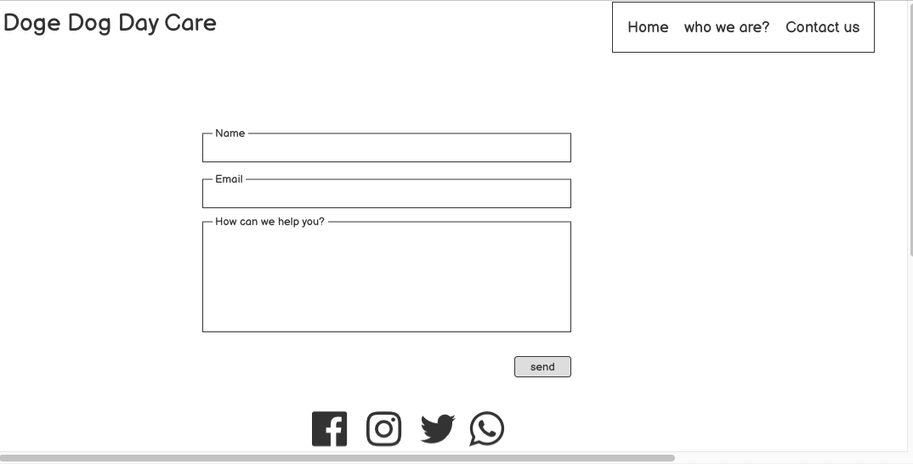

# Doge Dog Day Care - Project Portfolio 1 - HTML & CSS

 Doge Dog Day Care is a small company which hopes to help people who want to go on holidays or even spend long hours on a site without being concerned with the dog's care. The website will be targeted toward dog owners who are looking for a way to do what they need to without leaving the dogs on its own. Doge Dog Day Care will also be useful for dog owners to find places where they can socialize and take their pets together.

 Welcome to the live project here: [Doge Dog Day Care](https://tatigarrido.github.io/Doge-Dog-Day-Care/) 

 Image link https://ui.dev/amiresponsive ---- Goes here -----

 ## User Experience (UX)
 ### User stories 
    
   1. As a potential customer I want to be able to navigate easily and quickly understanding the purpose of the website.
   2. As a potential customer, I want to be able to navigate from the website to social media.
   3. As a potential customer, I want to be able to see the photos and read the testimonials, to help me make a decision.
   4. As a potential customer, I want to be able to contact the company through the website.

   ## Design

   * Colour Scheme
      * The two main colour used are coral and white.

   * Typography   
      * The DynaPuff and Roboto are the fonts that were used more often throughout the whole website with Sans Serif as the fallback font. The chosen fonts are ideal for the purpose of the website, which is: be fun and trustable.

     * Imagery
      *The large, background hero image is designed to catch the user's attention. The images on the testmonials page are designed to show users that customers and reviews are real and so are those dogs. The background image on the contact us page is designed to give the website some padding in a page where customers should fill with details only.  

   ## Wireframes
   The wireframes for Doge Dog Day Care were produced on Balsamiq. They are low fidelity as there have been modifications throughout the development website.

   

   

   

   ## Features

   ### Home
   

   A brief about what the company offers to the customers.

   ### Testmonials
   

   Customers reviews with their pets images. 

   ### Contact us
   

   Contact us form. 

   ## Technologies Used

   ### Languages Used

   * HTML5 - to create the website.
   * CSS3 - to create the website styling.

   ## Frameworks, Libraries & Programs Used

 1. Hover.css:
    * was used on the menu, social media icons and on "send" button.

 2. Google Fonts: 
    * to import the 'DynaPuff' and 'Roboto' font styles.

 3. Font Awesome: 
    * to import the icons.

 4. Git
    * used for version control.

 5. GitHub
    * to host and deploy the website.

 6. Balsamic
    * to create the wireframes on the design process.  

 7. Gitpod
    * to develop the project.

 8. Balsamiq
    * to create the wireframes.  

 9. Tiny PNG
    * to compress the documentation images.

 10. W3C HTML Validator
     * to validate the HTML.    

 11. W3C CSS Validator
     * to validate the CSS.     

 ## Testing

 The website was tested on the [W3C CSS Validator](https://jigsaw.w3.org/css-validator/) and [W3C HTML Validator](https://validator.w3.org/).

 ---- css and html validator checker images goes here -----

 ### Testing User Stories from User Experience (UX) Section
    
 1. As a potential customer I want to be able to navigate easily and quickly understanding the purpose of the website.

    a. the website has a navigation bar on the landing page, where the user can easily choose the path to be followed.
    b. the hero image has a text block which explais what is the website about.

 2. As a potential customer, I want to be able to navigate from the website to social media.

    a. All social media icons takes the user to their social media page in. a nwe tab.

 3. As a potential customer, I want to be able to see the photos and read the testimonials, to help me make a decision.

    a. The testmonials page display all the reviews with their respective's pets photos. 

 4. As a potential customer, I want to be able to contact the company through the website.

    a. The form page enables the user to send a message. All fields must be completed, including email,  what enables the company to reply the message with an email.

 ### Further Testing

* Friends were kindly requested to review the website on their own devices to point any user experience issues. 
* Daily tests have been made to make sure everything was working according the expected and any issues were corrected in the same day.
* The website was viewed in differents devices.

 *Known Bugs
 my footer is by my header -fixed add position relative ---- Goes here -----

 Image on testimonial, for mobile devices, has some text by the side. Fixed removing float:left;

 footer no mobile, is in the middle of the page.

 Text area box could be expanded by the user. (fix: style="resize: none" on the line code on html page )
 
 

 ## Deployment

 ### GitHub Pages

 *Forking the GitHub Repository

 *Making a Local Clone

 ## Credits
 
 ### Code
    * The hero image was inspired on hero image on loving running project

 ## Content
    * All content was written by the developer.

 ## Media
 1. The dog's images used on the website are from this open source site: https://unsplash.com/ ---- add the exacly link ----

 2.  The image background on contact us page,  is from this open source site:
 
https://www.freepik.com/free-vector/frame-with-dogs-vector-white-background_17432981.htm#query=pet%20background&position=3&from_view=keyword

<a href='https://www.freepik.com/vectors/watercolor-dog'>Watercolor dog vector created by rawpixel.com - www.freepik.com</a>

## Acknowledgements
  