# Doge Dog Day Care - Project Portfolio 1 - HTML & CSS

 Doge Dog Day Care is a small company which hopes to help people who want to go on holidays or even spend long hours on a site without being concerned with the dog's care. The website will be targeted toward dog owners who are looking for a way to do what they need to without leaving the dogs on its own. Doge Dog Day Care will also be useful for dog owners to find places where they can socialize and take their pets together.

 Welcome to the live project here: [Doge Dog Day Care](https://tatigarrido.github.io/Doge-Dog-Day-Care/) 

 

 ## User Experience (UX)
 ### User stories 
    
   1. As a potential customer, I want to be able to navigate easily and quickly understanding the purpose of the website.
   2. As a potential customer, I want to be able to navigate from the website to social media.
   3. As a potential customer, I want to be able to see the photos and read the testimonials, to help me make a decision.
   4. As a potential customer, I want to be able to contact the company through the website.

   ## Design

   * Colour Scheme
      * The two main colour used are coral and white.

   * Typography   
      * The DynaPuff and Roboto are the fonts that were used more often throughout the whole website with Sans Serif as the fallback font. The chosen fonts are ideal for the purpose of the website, which is: be fun and trustable.

   * Imagery
      * The large, background hero image is designed to catch the user's attention. The images on the testimonials page are designed to show users that customers and reviews are real and so are those dogs. The background image on the contact us page is designed to give the website some padding in a page where customers should fill with details only.  

   ## Wireframes
   The wireframes were produced on Balsamiq. They were built as being part of the first version of the website. Modifications were made throughout the website development.

   

   

   

   ## Features

   ### Home
   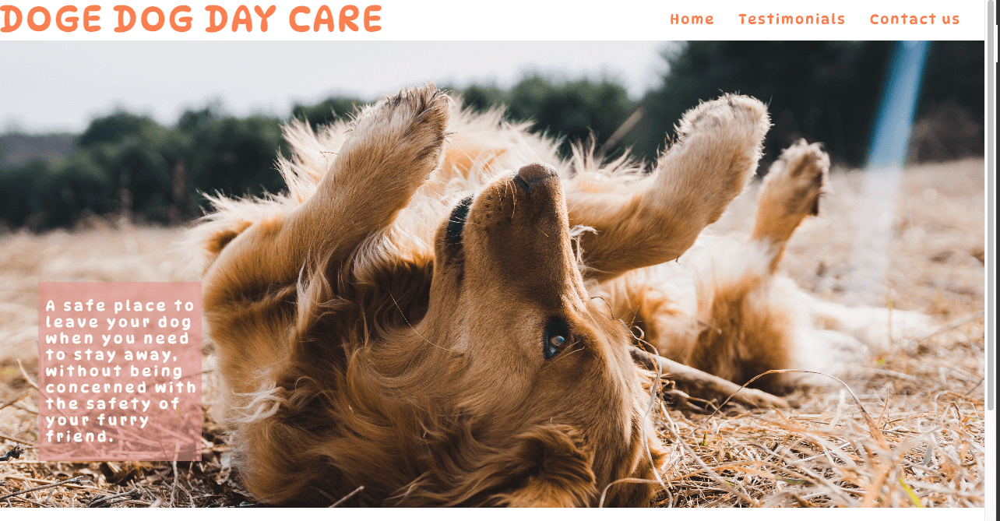

   A brief about what the company offers to the customers.

   ### History
   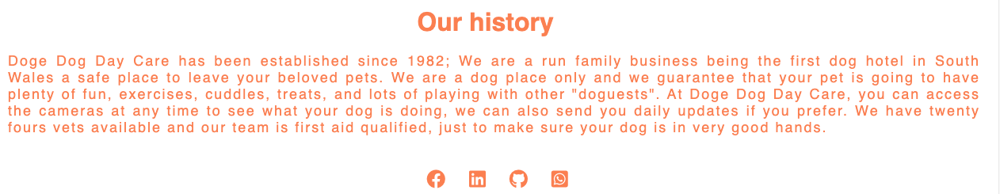

   The history and what the company offer to the customers. 

   ### Testmonials
   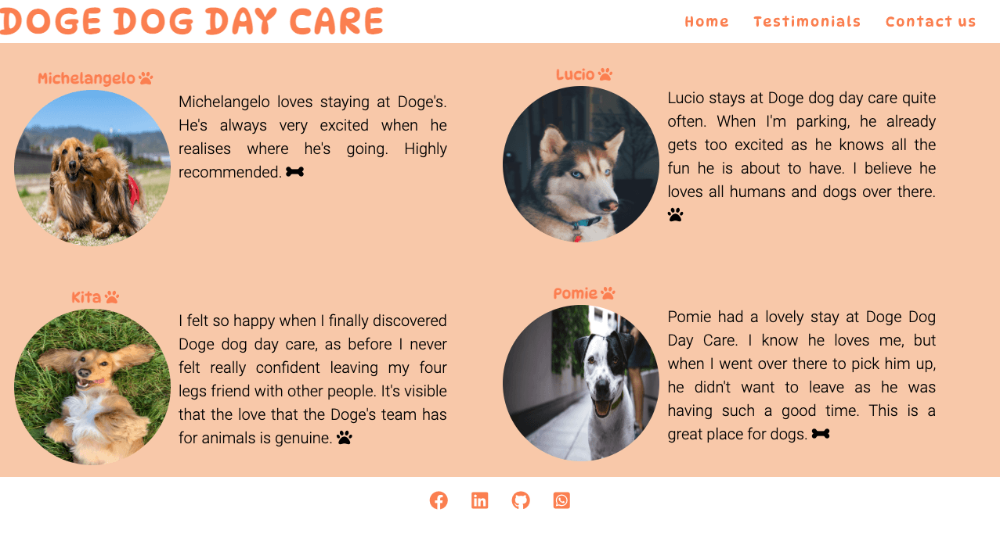

   Customers reviews with their pets images. 

   ### Contact us
   

   Contact us form. 

   ### Thank you
   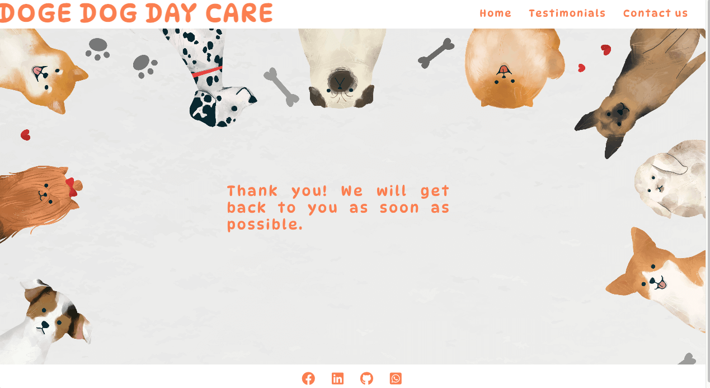

   A "thank you" message will be prompted when a customer fills out the form to send a message. 

   ### Footer
   

   The footer section contains social media links that take users to the company's social media in a new page. 

   ## Technologies Used

   ### Languages Used

   * HTML5 - to create the website.
   * CSS3 - to create the website styling.

   ## Frameworks, Libraries & Programs Used

 1. Hover.css:
    * Was used on the menu, social media icons and on "send" button.

 2. Google Fonts: 
    * To import the 'DynaPuff' and 'Roboto' font styles.

 3. Font Awesome: 
    * To import the icons.

 4. Git
    * Used for version control.

 5. GitHub
    * To host and deploy the website. 

 7. Gitpod
    * To develop the project.

 8. Balsamiq
    * To create the wireframes.  

 9. Tiny PNG
    * To compress the documentation images.

 10. W3C HTML Validator
     * To validate the HTML.    

 11. W3C CSS Validator
     * To validate the CSS.   

 12. Lighthouse
     * To test the quality and accessibility of the website.      

 ## Testing

 The website was tested on the [W3C CSS Validator](https://jigsaw.w3.org/css-validator/) and [W3C HTML Validator](https://validator.w3.org/).

 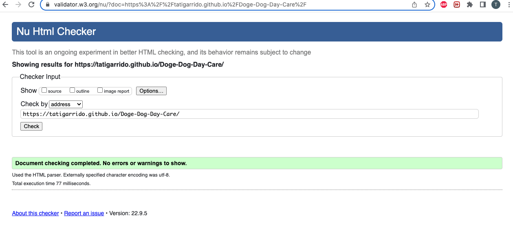
 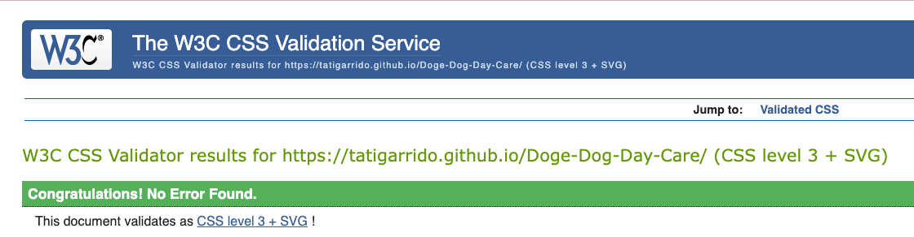

 ### Testing User Stories from User Experience (UX) Section
    
 1. As a potential customer, I want to be able to navigate easily and quickly understanding the purpose of the website.

    a. The website has a navigation bar on the landing page, where the user can easily choose the path to be followed.

    b. The hero image has a text block which explains what is the website about.

    c. Our history introduces the user to the company.

 2. As a potential customer, I want to be able to navigate from the website to social media.

    a. Each social media icon takes the user to the social media page in a new tab.

 3. As a potential customer, I want to be able to see the photos and read the testimonials, to help me make a decision.

    a. The testimonials page display all the reviews and respectives pets images. 

 4. As a potential customer, I want to be able to contact the company through the website.

    a. The form page enables the user to send a message. All fields must be completed, including email, which enables the company to reply the message.

 ### Further Testing

* Friends were kindly requested to review the website on their own devices to point out any user experience issues. 
* Daily tests have been made to make sure everything was working to the expected and any issues found have been corrected on the same day.
* The website was viewed in different devices.

## Additional Testing

 The website was checked for color contrast accessibility validator.

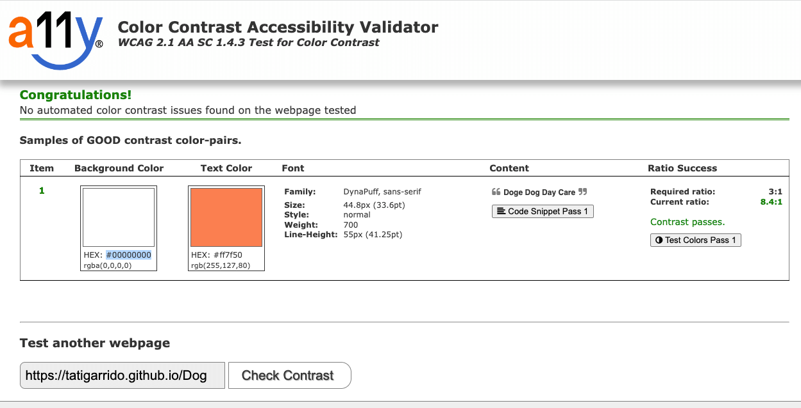

### Lighthouse
 The website was tested on [Google Lighthouse](https://developer.chrome.com/docs/lighthouse/overview/) to improve the performance, accessibility and, quality of the website. 

 ### Bugs Fixed

 During the process of testing the website some errors were found and corrected.

 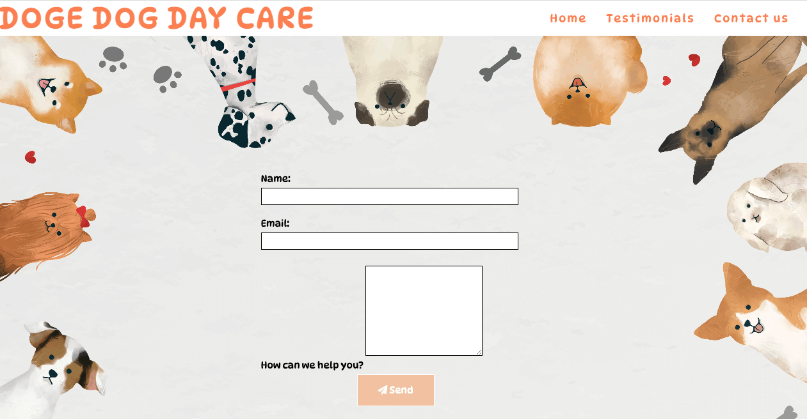 
 
 In this corrected bug, the user was allowed to resize the text area in many sizes.

 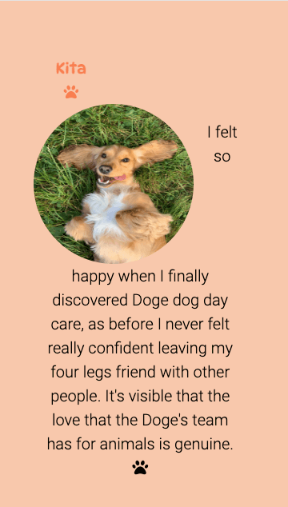
 
 In this corrected bug, when the website was viewed on mobile, the text was floating by the image, but only in one of the four testimonials.

 ## Deployment

 ### GitHub Pages

To deploy this project on the GitHub pages:

1.  Locate the repository on Github.
2.  On the top, right of the repository, click on settings tab.
3.  On the left, down, click on pages tab.
4.  Under the source, chose the option "Deploy from a branch".
5.  Select the option "main" and the folder called "root".
6.  The page will automatically refresh.
7.  Below GitHub Pages, it is possible to find the address where the website can be find live. 
8.  Click on "Visit site" button, or copy and paste the address on your navigation bar.

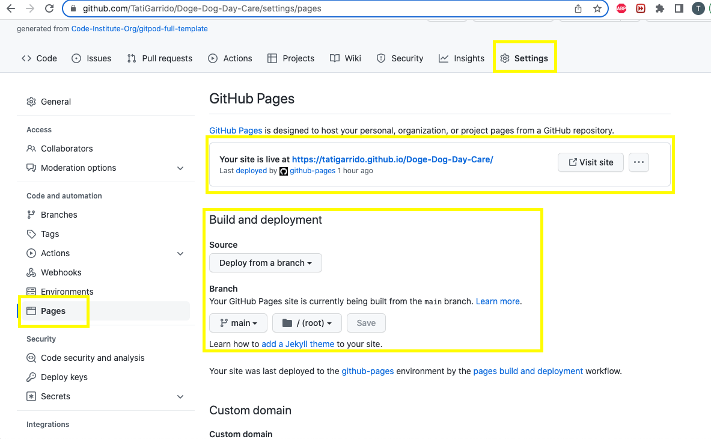

[Link to the Github Repositoty](https://github.com/TatiGarrido/Doge-Dog-Day-Care/)

 ### Forking the GitHub Repository

 Forking a repository allows the developers to view and/or make changes without affecting the original repository. To fork this repository, follow the steps:

 1. Log in and find the [the Repositoty](https://github.com/TatiGarrido/Doge-Dog-Day-Care/)
 2. Click on the button fork on the top, left of the page to create a copy of the repository. 

 ### Making a Local Clone
 
 To clone a repository, follow the steps:

 1. Log into GitHub and locate the repository.
 2. By the green Gitpod button, click on "code" and copy the URL link.
 3. Open your IDE terminal.
 4. Leave the current working directory typing, cd .. .
 5. Type git clone, past the URL and add a name for the clone.
 6. Press enter and the clone will be created. 

  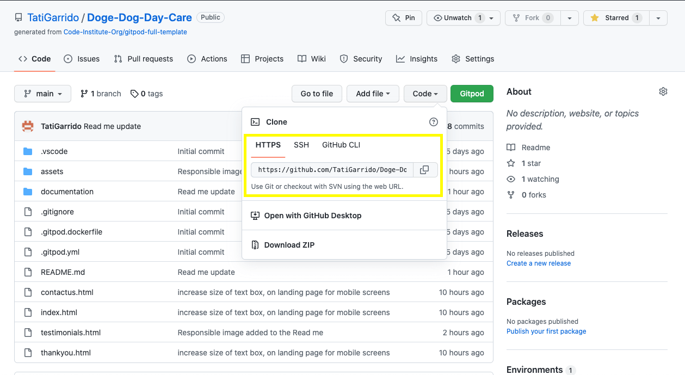

  Oficial documentation to clone a repository can be found [here.](https://docs.github.com/en/repositories/creating-and-managing-repositories/cloning-a-repository) 

 ## Credits
 ### Code

 * The hero image was inspired on love running project.

 ## Content

 * All content was written by the developer.

 ## Media

 1. [Unplash](https://unsplash.com/photos/G8cB8hY3yvU), to create the testimonials - Kita.
 2. [Unplash](https://unsplash.com/photos/v0_MCllHY9M), to create the testimonials - Lucio.
 3. [Unplash](https://unsplash.com/photos/NH1d0xX6Ldk), to create the testimonials - Pomie.
 4. [Unplash](https://unsplash.com/photos/YBEcRCuufVk), to create the testimonials - Michelangelo.
 5. [Unplash](https://unsplash.com/photos/t7wwffh6x8E), to create the hero image.
 6. [Freepik](https://www.freepik.com/free-vector/frame-with-dogs-vector-white-background_17432981.htm#query=pet%20background&position=3&from_view=keyword) The image background on contact us page,  is from this open source site.

  